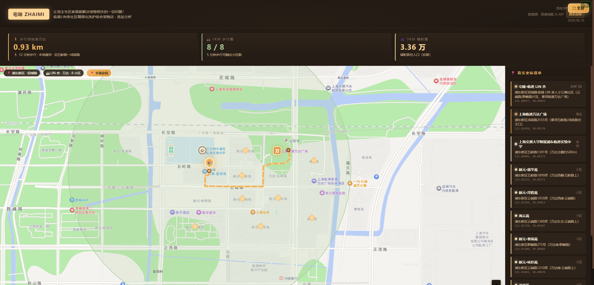
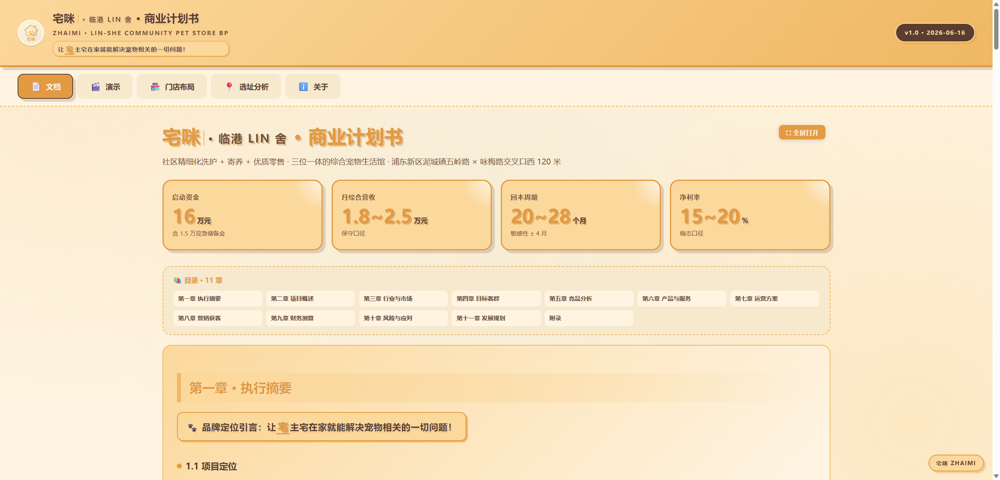
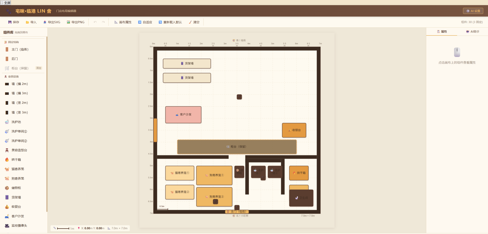

# 宅咪·临港 LIN 舍 — 宠物洗护店

[](https://sunganhao8-lgtm.github.io/zhaimi-linshe-bp/)
[](LICENSE)
[](https://github.com/sunganhao8-lgtm/zhaimi-linshe-bp)
[](https://github.com/sunganhao8-lgtm/zhaimi-linshe-bp/commits/main)

> 临港泥城片区 49㎡ **宠主同乐·宠物洗护+电竞空间** 融合店 · 商业计划书 + 选址地图 + 门店布局编辑器完整交付物

> **核心数据**：启动资金 **22 万**（电竞 0.66 万从流动资金出） · 月固定 **1.57 万** · 回本 **24-32 月** · 客流 1km/6 小区/900 户 · 6 家竞品

---

## 🌐 在线预览

部署在 GitHub Pages，**点一下直接打开**：

- 🏠 **[项目入口](https://sunganhao8-lgtm.github.io/zhaimi-linshe-bp/)** — `index.html`
- 📊 **[商业计划书演示](https://sunganhao8-lgtm.github.io/zhaimi-linshe-bp/bp.html)** — 18 页幻灯片（含电竞展示区·第 9 张）
- 🗺️ **[选址分析地图](https://sunganhao8-lgtm.github.io/zhaimi-linshe-bp/site-map.html)** — 11 个真实 POI + 步行路径
- 🎨 **[门店布局编辑器](https://sunganhao8-lgtm.github.io/zhaimi-linshe-bp/layout-editor.html)** — 49㎡ (7×7) 可拖拽设计（含电竞组件：投影/幕布/Switch 2/洞洞板/吧台）

---

## 📸 项目预览

<div align="center">

### 🗺️ 选址分析地图


### 📊 商业计划书


### 🎨 门店布局编辑器


</div>

---

## 📦 项目结构

```
.
├── index.html              # 项目入口（4 大模块 Tab）
├── bp.html / bp.md         # 18 页商业计划书（演示 + 源文档，含第 9 张电竞展示区）
├── site-map.html           # 选址分析地图（AMap + 真实 POI + 步行路径）
├── layout-editor.html      # 49㎡ 门店布局编辑器（Konva.js + 碰撞检测）
├── data/
│   └── poi.json            # 11 个真实 POI + 步行路径 polyline（本地缓存）
├── assets/
│   ├── zhaimi-logo.png     # 品牌 Logo
│   ├── zhaimi-hero.png     # 主页背景图
│   ├── preview-site-map.png # 站点地图预览截图
│   ├── preview-bp.png       # 商业计划书预览截图
│   └── preview-layout.png   # 布局编辑器预览截图
├── vendor/
│   └── amap/               # 高德地图 JS API loader（离线可用）
├── LICENSE                  # MIT 开源协议
└── README.md
```

> 注：`vendor/osm-tiles/`（OSM 瓦片缓存，几百 MB）已 gitignore，不入库。

---

## 🎯 核心数据（基于真实调研）

| 维度 | 数据 | 来源 |
|---|---|---|
| 选址 | 临港泥城 · 万达广场东侧 500m | AMap POI 实测 |
| 面积 | **49㎡** (7m × 7m) | 实地勘察 |
| 启动资金 | **22 万**（转让 9.5w + 房租 4w + 设备 4.2w + 电竞 0.66w + 装修/证照/流动 3.64w） | BP 财务模型 |
| 月固定成本 | **1.57 万**（房租 6700 + 人力 6500 + 水电 1000 + 杂费 1500） | BP 财务模型 |
| 回本周期 | **24-32 个月** | BP 财务模型 |
| 步行圈 | **1km** 覆盖 6 个小区 · 3km 辐射 30 万人口 | AMap 真实步行路径 |
| 客群 | 万达上班族 + 6 大住宅区养宠家庭 + 2 所学校家长 | POI 分类 |

---

## 🚀 本地运行

```bash
# 任意 HTTP 服务器都可以（必须走 http://，file:// 会因 CORS 报错）
cd final
python -m http.server 8090

# 浏览器打开
# http://localhost:8090/
```

**依赖**：仅需浏览器（Chrome / Edge / Safari 最新版）。所有第三方资源（高德地图 API、Konva.js）已本地化到 `vendor/` 和 CDN，无需联网即可运行核心功能。

---

## 📝 License · 贡献 · 更新记录

- 📄 **License**：MIT — 详见 [LICENSE](LICENSE)
- 🤝 **如何贡献**：详见 [CONTRIBUTING.md](CONTRIBUTING.md)（含合伙人协作流程）
- 📝 **更新记录**：详见 [CHANGELOG.md](CHANGELOG.md)
- 🐛 **反馈问题**：[Issues](../../issues) 页面提供 3 种模板（Bug / Feature / 内容更新）

## 🙋 合伙人快速入口

> 写给合伙人和新加入者，30 秒抓重点。

- 🙋 **[PARTNER_FAQ.md](PARTNER_FAQ.md)** — 合伙人最关心的 4 个问题（每天挣多少 / 洗多少单 / 客源够不够 / 位置合不合适）
- 📖 **[PROJECT_HISTORY.md](PROJECT_HISTORY.md)** — 3 天从 0 到 1 的项目演进故事
- 📋 **[DECISIONS.md](DECISIONS.md)** — 9 条关键决策记录（选址 / 49㎡ / 23.5 万 / 回本周期 / 数据本地化 / 电竞展示区 等）

---

<div align="center">

**[⬆ 回到顶部](#宅咪临港-lin-舍--宠物洗护店)** ·

Made with ❤️ for 临港泥城养宠家庭

</div>